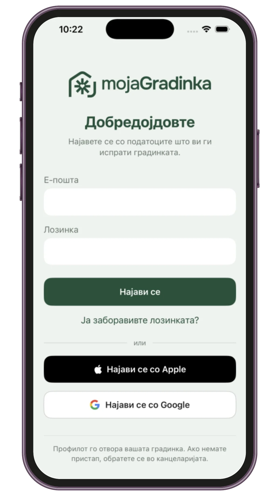
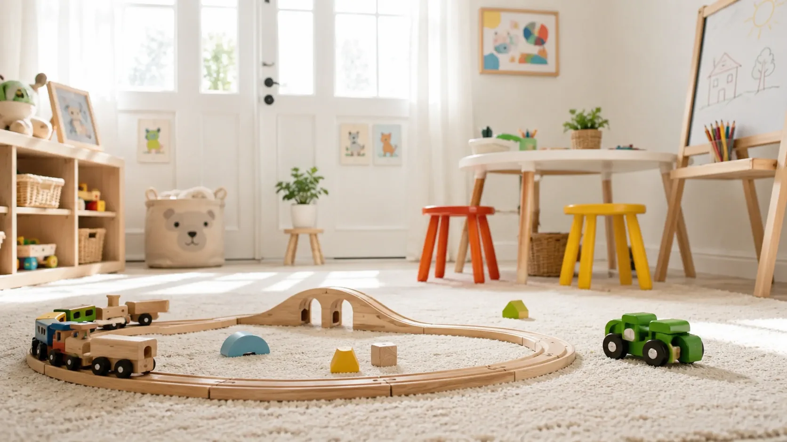

# MojaGradinka Landing Page — Production Optimization Brief

## Objective

Optimize and clean up the existing **MojaGradinka landing page** and make it production-ready.

The current design, branding, visual identity, layout direction, illustrations, colors, animations, and overall feel are already approved and should be preserved.

This task is **NOT a redesign**.

The goal is to improve:

- HTML structure
- Code quality
- SEO
- Accessibility
- Performance
- Conversion
- Form handling
- Security/privacy messaging
- Mobile usability
- Production readiness

Existing website:

`https://shristovski.github.io/MojaGradinka_Web/Landing-Page-MojaGradinka.html`

Repository structure currently contains the landing page, CSS, assets, images, fonts, and JavaScript embedded in the HTML.

---

# VERY IMPORTANT — DO NOT REDESIGN THE WEBSITE

Preserve the existing:

- MojaGradinka branding
- Yellow: `#FEC21B`
- Blue: `#71BDE9`
- Orange: `#F27740`
- Illustrations
- Bears / child-friendly visual style
- Hero composition
- Phone mockups
- Web application mockups
- Section order unless explicitly changed below
- Existing animations where practical
- Rounded UI style
- Typography personality
- Overall spacing and visual feel
- Responsive/mobile concept

Do not replace the site with a generic SaaS template.

Do not simplify away the visual personality.

Do not introduce Bootstrap, Tailwind, React, Vue, or another framework.

Keep it as a lightweight static website unless functionality requires otherwise.

---

# PRIORITY 1 — CLEAN THE HTML DOCUMENT STRUCTURE

The current exported/generated HTML contains some prototype/framework remnants.

Clean these up.

## Required changes

Use a normal HTML5 structure:

```html
<!DOCTYPE html>
<html lang="mk">
<head>
    ...
</head>
<body>
    ...
</body>
</html>
```

Remove unnecessary/generated elements such as:

```html
<x-dc>
<helmet>
```

and any corresponding closing tags.

Move all valid metadata that is currently inside `<helmet>` into the real `<head>` element.

Remove obsolete generated/runtime code that is not needed by the live website.

Review references such as:

```html
<script src="./support.js"></script>
<script src="./image-slot.js"></script>
```

If these files do not exist or are not actually required, remove those script references.

Also remove unnecessary DC/export framework remnants such as:

```html
<script type="text/x-dc" data-dc-script data-props="{}">
class Component extends DCLogic {
  renderVals() {
    return {};
  }
}
</script>
```

Only remove code after verifying it is not required by any visible functionality.

---

# PRIORITY 2 — RENAME LANDING PAGE TO INDEX.HTML

Rename:

```text
Landing-Page-MojaGradinka.html
```

to:

```text
index.html
```

The GitHub Pages homepage should then work from:

```text
https://shristovski.github.io/MojaGradinka_Web/
```

All asset paths and internal links must continue working after the rename.

Do not break GitHub Pages deployment.

---

# PRIORITY 3 — IMPROVE HTML SEMANTICS

Replace generic layout `<div>` elements with semantic elements where appropriate.

Use:

```html
<header>
<nav>
<main>
<section>
<footer>
```

For example:

```html
<nav class="mg-nav">
```

instead of a generic navigation `<div>`.

Major content areas should use `<section>`.

The main page content should be inside:

```html
<main>
```

Footer should use:

```html
<footer>
```

Do this without affecting the existing visual appearance.

---

# PRIORITY 4 — CORRECT HEADING STRUCTURE

The page must have one clear `<h1>`.

The current main hero headline should become the H1.

Example:

```html
<h1 class="mg-hero__title">
    Спокојно детство
    <span>секој ден, без грижи</span>
</h1>
```

Use `<h2>` for major sections such as:

- Функционалности
- Мобилна апликација
- Веб апликација
- Зошто mojaGradinka
- Понуди
- Закажи демо

Use `<h3>` for individual feature cards where appropriate.

Do not use heading tags purely for visual styling.

---

# PRIORITY 5 — HERO VALUE PROPOSITION

Keep the existing emotional headline:

**Спокојно детство  
секој ден, без грижи**

Do not remove it.

Add a clear supporting sentence immediately below it so a first-time visitor understands what MojaGradinka actually is.

Suggested copy:

> Дигитална платформа што ги поврзува градинките, воспитувачите и родителите на едно безбедно место.

Keep this concise.

## Hero CTA

The strongest CTA should be:

**Закажи демо**

Add a secondary CTA:

**Погледни како функционира**

or keep the existing:

**Дознај зошто**

as the secondary CTA.

The primary button should scroll to the demo form.

The secondary button should scroll to the product/features section.

---

# PRIORITY 6 — FIX FEATURE AUDIENCE LABELS

The existing feature tabs currently use wording similar to:

```text
Корисници
Родители
```

This is ambiguous because parents are also users.

Change them to:

```text
Градинки
Родители
```

Preferred alternative:

```text
За градинки
За родители
```

Use whichever option visually fits the current design best.

Do not change the actual feature content unless needed for language cleanup.

---

# PRIORITY 7 — REAL DEMO FORM SUBMISSION

This is one of the most important changes.

The demo form must **NOT rely on `mailto:`**.

Currently the form prepares an email and launches the visitor's mail client.

Replace this with a real web form submission.

## Desired flow

```text
Visitor
   ↓
Demo form
   ↓
Form endpoint / API
   ↓
Successful submission
   ↓
Success message
```

For the current static GitHub Pages version, use a simple static-site compatible form service if no backend endpoint exists.

Suitable approaches include services such as:

- Formspree
- Web3Forms

Do not introduce unnecessary backend infrastructure solely for this landing page.

Make the implementation easy to replace with the real MojaGradinka backend later.

## Required fields

Preserve the existing useful fields such as:

- Name
- Kindergarten / organization
- Email
- Phone
- Number of children if present
- Message if present

Use proper:

```html
<label>
```

elements.

Use appropriate input types:

```html
type="email"
type="tel"
```

Required fields should use:

```html
required
```

Add reasonable client-side validation.

---

# FORM SUCCESS STATE

After successful submission, show an inline success state.

Suggested Macedonian copy:

> Ви благодариме!  
> Вашето барање е успешно испратено. Ќе ве контактираме наскоро.

Do not redirect the visitor into their email application.

Do not display a fake success state if the HTTP request actually fails.

On failure show a clear error message such as:

> Настана грешка при испраќањето. Ве молиме обидете се повторно или контактирајте нè директно.

---

# PRIORITY 8 — REMOVE MAILTO FORM EXPLANATION

Remove any message similar to:

> Отвора е-пошта со пополнетите податоци...

This will no longer be relevant after real form submission is implemented.

---

# PRIORITY 9 — SEO METADATA

Add/verify all important production metadata.

## HTML language

Use:

```html
<html lang="mk">
```

## Title

Use a descriptive title similar to:

```html
<title>mojaGradinka — Апликација за градинки и родители</title>
```

## Description

Create a strong Macedonian description.

Example:

```html
<meta
    name="description"
    content="mojaGradinka е дигитална платформа за градинки, воспитувачи и родители — администрација, активности, комуникација, финансии и важни информации за детето на едно безбедно место."
>
```

Keep it reasonably concise.

---

# PRIORITY 10 — CANONICAL URL

For the final production domain prepare:

```html
<link rel="canonical" href="https://mojagradinka.mk/">
```

If this creates problems while testing only through GitHub Pages, document it clearly but structure the page so the production canonical can easily remain `https://mojagradinka.mk/`.

---

# PRIORITY 11 — OPEN GRAPH / SOCIAL SHARING

Add Open Graph metadata.

Example:

```html
<meta property="og:type" content="website">

<meta
    property="og:title"
    content="mojaGradinka — Апликација за градинки и родители"
>

<meta
    property="og:description"
    content="Сè што им е потребно на градинките и родителите, на едно безбедно место."
>

<meta
    property="og:image"
    content="https://mojagradinka.mk/assets/social-preview.jpg"
>

<meta
    property="og:url"
    content="https://mojagradinka.mk/"
>
```

Also add useful Twitter/X card metadata:

```html
<meta name="twitter:card" content="summary_large_image">
```

Create or prepare a suitable social sharing image using the existing branding/assets if one does not already exist.

Do not redesign branding for this image.

---

# PRIORITY 12 — FAVICON

Use the existing MojaGradinka app/logo icon as the favicon.

Add appropriate favicon declarations.

For example:

```html
<link rel="icon" href="assets/favicon.png">
```

If appropriate, also prepare:

```html
<link rel="apple-touch-icon" href="assets/apple-touch-icon.png">
```

Use existing branding.

---

# PRIORITY 13 — STRUCTURED DATA

Add basic Organization / SoftwareApplication structured data where appropriate.

Use JSON-LD.

Do not make claims that are not present on the site.

Possible structure:

```html
<script type="application/ld+json">
{
  "@context": "https://schema.org",
  "@type": "SoftwareApplication",
  "name": "mojaGradinka",
  "applicationCategory": "BusinessApplication",
  "operatingSystem": "Web, iOS, Android"
}
</script>
```

Only include iOS/Android if this accurately reflects the product roadmap/current availability.

Avoid fabricated ratings, reviews, prices, or customer numbers.

---

# PRIORITY 14 — PRIVACY POLICY AND TERMS

The footer currently contains legal links that do not lead to real legal pages.

Create:

```text
privacy.html
terms.html
```

The landing page links should point to these pages.

Do not link Privacy Policy or Terms back to the demo form.

## Privacy page

Create a clean page consistent with MojaGradinka branding.

It should at minimum have placeholders/sections for:

- Controller/company information
- What personal information is collected
- Why the information is collected
- Data related to children
- Legal basis
- Data retention
- Data sharing
- Security
- Cookies if applicable
- User rights
- Contact information

Do NOT invent legal commitments or certifications.

Where legal review is required, clearly mark:

```text
[LEGAL REVIEW REQUIRED]
```

The content should be structured for later lawyer review.

## Terms page

Prepare a professional structural draft including:

- Service description
- Account responsibilities
- Acceptable use
- Intellectual property
- Availability
- Limitation of liability
- Termination
- Changes to terms
- Contact

Again, clearly mark areas requiring legal validation.

Do not fabricate legally binding facts.

---

# PRIORITY 15 — SECURITY & PRIVACY TRUST SECTION

Create a dedicated security/privacy-oriented section on the landing page.

This is important because MojaGradinka handles information related to children.

Suggested headline:

## Податоците на децата заслужуваат посебна заштита.

Suggested content:

### Безбеден пристап

Само овластени корисници имаат пристап до информациите што им се потребни.

### Заштита на лични податоци

Податоците се обработуваат внимателно и со соодветни технички и организациски мерки.

### Контролирана комуникација

Важните информации не мора да се споделуваат преку приватни Viber групи или лични профили.

### Контрола на пристап

Секој корисник има пристап само до функциите и информациите што се релевантни за неговата улога.

Use the existing visual language.

Do not make unverifiable statements such as:

- "military-grade encryption"
- "100% secure"
- specific certifications that do not exist
- GDPR compliance unless this has actually been legally/technically established

---

# PRIORITY 16 — REVIEW MEDICAL TERMINOLOGY

Avoid positioning MojaGradinka as a healthcare/EHR system unless it truly provides that regulated functionality.

If the site currently says:

**Целосен медицински картон**

consider replacing it with wording such as:

**Здравствени информации за детето**

or:

**Важни здравствени информации**

Example supporting information:

- Алергии
- Здравствени напомени
- Итни контакти
- Важни ограничувања
- Информации потребни за престојот во градинка

Do not suggest diagnosis or medical treatment functionality unless it actually exists.

---

# PRIORITY 17 — ADD "ЗОШТО mojaGradinka?" BENEFIT SECTION

The site already explains many features.

Add a concise section focused on business/user outcomes rather than another list of features.

Suggested heading:

## Зошто mojaGradinka?

Suggested cards:

### За директорите

Помалку администрација. Повеќе време за управување со градинката.

### За воспитувачите

Сите важни информации за групата на едно место.

### За родителите

Навремени информации за секојдневието на детето, без непотребни пораки и групни разговори.

Keep it concise and visually aligned with the existing design.

Do not make the page excessively long.

---

# PRIORITY 18 — APP STORE / GOOGLE PLAY STATUS

If the mobile application has not yet officially launched in the stores, the existing App Store / Google Play elements must not appear like active download buttons.

Change them to something such as:

**Наскоро на App Store**

**Наскоро на Google Play**

or:

**Мобилната апликација доаѓа наскоро**

If the app is already available, replace them with proper links to the exact app store URLs.

Do not use fake links.

---

# PRIORITY 19 — PRICING/PACKAGES CONTENT

Preserve the current visual design of the pricing cards.

Review whether infrastructure-focused items such as:

```text
5GB
25GB
100GB+
```

need to be visible as primary selling points.

Kindergarten buyers are more likely to understand value based on:

- Number of children
- Number of locations
- Administration features
- Parent application
- Finance
- Payments
- Reports
- Support level
- Multiple kindergarten locations
- Permissions

Do not invent package limitations or exact numbers.

If those values are not defined yet, keep the cards but replace uncertain infrastructure-specific details with neutral placeholders or existing confirmed feature differences.

Do not introduce new pricing amounts.

---

# PRIORITY 20 — PERFORMANCE: IMAGE OPTIMIZATION

Review all raster image assets.

Examples include:

- hero photos
- phone mockups
- laptop/web app screenshots
- trees
- bears
- decorative PNG files

Convert appropriate large raster images to:

```text
WebP
```

and optionally:

```text
AVIF
```

Keep PNG only where transparency or quality requirements justify it.

Do NOT destroy visual quality.

For important images use `<picture>` where useful.

Example:

```html
<picture>
    <source srcset="assets/hero-photo.avif" type="image/avif">
    <source srcset="assets/hero-photo.webp" type="image/webp">
    
</picture>
```

---

# PRIORITY 21 — LAZY LOAD BELOW-THE-FOLD IMAGES

For images that do not appear immediately in the first viewport, use:

```html
loading="lazy"
decoding="async"
```

Example:

```html

```

Do NOT lazy-load:

- primary logo if needed immediately
- hero's main visual if immediately visible
- important above-the-fold imagery

---

# PRIORITY 22 — IMAGE DIMENSIONS / CLS

Add explicit intrinsic dimensions to significant `` elements.

Example:

```html

```

Use the actual image aspect ratio.

Do not distort images.

This should reduce layout shift during loading.

Prioritize:

- hero image
- logo
- phone mockups
- laptop mockup
- bears
- tree
- major decorative raster images

---

# PRIORITY 23 — ALT TEXT

Review every image.

Decorative images should generally use:

```html
alt=""
```

Meaningful images should use concise Macedonian alt text.

Do not keyword-stuff.

For example:

```html
alt="Приказ на мобилната апликација mojaGradinka"
```

Do not describe purely decorative leaves/bears unnecessarily to screen readers.

---

# PRIORITY 24 — FONT OPTIMIZATION

Review the currently loaded font families.

The project appears to use fonts such as:

- Manrope
- Fredoka
- Literata
- Caveat

Determine which are actually used.

If one is loaded but barely or never used, remove it.

Preferred direction if visually consistent:

```text
Manrope — main body/UI
Fredoka — playful display/headings
Caveat — limited decorative accents
```

Remove Literata only if doing so does not negatively affect the approved visual design.

Do not replace the branding typography with generic system fonts simply for performance.

Use:

```css
font-display: swap;
```

where appropriate for self-hosted fonts.

---

# PRIORITY 25 — JAVASCRIPT ORGANIZATION

Move the site's custom JavaScript from the bottom of the HTML into:

```text
js/app.js
```

The resulting project can use:

```text
index.html
css/app.css
js/app.js
assets/
privacy.html
terms.html
```

or, if moving CSS would create unnecessary path churn, keeping:

```text
app.css
```

at root is acceptable.

Main goal:

- separate HTML structure
- styling
- behavior

Do not create unnecessary build tooling.

---

# PRIORITY 26 — ANIMATION PERFORMANCE

Preserve the visual animations unless they produce actual performance problems.

Current technologies may include:

- Lenis
- GSAP
- ScrollTrigger
- custom requestAnimationFrame logic
- custom parallax logic

Review the custom animation loop.

Avoid repeatedly calling expensive:

```js
getBoundingClientRect()
```

for many elements on every animation frame if this can be avoided.

Where practical, consolidate scroll-linked animations into GSAP ScrollTrigger.

Use IntersectionObserver for simple reveal animations where appropriate.

However:

**DO NOT aggressively refactor animations at the expense of visual quality or introduce regressions.**

Animation refactoring is lower priority than:

- form submission
- semantic HTML
- SEO
- legal links
- image optimization

---

# PRIORITY 27 — RESPECT REDUCED MOTION

Preserve and improve the existing:

```css
@media (prefers-reduced-motion: reduce)
```

behavior.

When reduced motion is requested:

- avoid smooth scrolling
- stop decorative infinite animations
- disable unnecessary parallax
- ensure hidden animated content remains visible

Do not make content inaccessible when animations are disabled.

---

# PRIORITY 28 — TAB ACCESSIBILITY

The Gradinki / Roditeli tabs should use complete WAI-ARIA semantics.

Example:

```html
<div role="tablist">

<button
    id="tab-kindergartens"
    role="tab"
    aria-selected="true"
    aria-controls="panel-kindergartens"
>
    Градинки
</button>

<button
    id="tab-parents"
    role="tab"
    aria-selected="false"
    aria-controls="panel-parents"
>
    Родители
</button>

</div>
```

Panels:

```html
<div
    id="panel-kindergartens"
    role="tabpanel"
    aria-labelledby="tab-kindergartens"
>
```

Support keyboard interaction:

- Left Arrow
- Right Arrow
- Home
- End

Ensure focus states are visible.

---

# PRIORITY 29 — BUTTON / LINK ACCESSIBILITY

Ensure clickable elements are actual:

```html
<button>
```

or:

```html
<a href="">
```

Do not use `<span>` or `<div>` as interactive controls.

All interactive elements must be keyboard accessible.

Add visible `:focus-visible` states consistent with branding.

---

# PRIORITY 30 — COLOR CONTRAST

Review text over:

- yellow
- blue
- orange
- beige/light backgrounds
- photography

Make sure normal text remains readable.

Do not significantly alter the approved brand palette.

If contrast improvements are needed, adjust text shade/background usage rather than changing primary branding colors.

---

# PRIORITY 31 — MOBILE RESPONSIVENESS

Preserve the current responsive concept but test carefully at:

```text
320px
360px
375px
390px
430px
768px
1024px
1440px
```

Check:

- hero does not overflow
- buttons do not get clipped
- text does not overlap illustrations
- feature cards fit correctly
- tab controls remain usable
- pricing cards remain readable
- demo form fields remain full-width where appropriate
- phone mockups do not exceed viewport
- footer remains readable
- navigation remains functional

No horizontal page scrolling should occur.

---

# PRIORITY 32 — NAVIGATION

Ensure navigation anchor links work correctly after renaming to `index.html`.

Use meaningful section IDs.

For example:

```text
#funkcionalnosti
#mobilna-aplikacija
#web-aplikacija
#ponudi
#demo
```

If smooth scrolling remains enabled, respect reduced-motion preferences.

The primary navigation CTA should lead to the demo form.

---

# PRIORITY 33 — PHONE NUMBER

The current website contains a placeholder similar to:

```text
+389 70 000 000
```

Do not leave this placeholder on a production release.

If a confirmed production phone number is not available, remove the phone number rather than inventing one.

Keep the confirmed contact email if valid.

---

# PRIORITY 34 — CONTENT PROOFREADING

Perform a Macedonian proofreading pass.

Pay special attention to accidental mixed Latin/Cyrillic words.

For example change:

```text
твojaтa
```

to:

```text
твојата
```

Review all headings, CTA text, form labels, feature descriptions, navigation items, and footer copy.

Prefer natural Macedonian terminology.

For example, consider replacing awkward English/Macedonian combinations such as:

```text
chat-платформа
```

with wording such as:

```text
безбедна комуникација
```

or:

```text
платформа за комуникација
```

Do not change product-specific terms where the current wording is intentional.

---

# PRIORITY 35 — SOCIAL PROOF PLACEHOLDER

Do not fabricate customers or testimonials.

However, structure the code so a future section can easily be added for:

```text
Градинки што ни веруваат
```

This could later contain:

- customer logos
- testimonials
- number of institutions
- number of parents

Do not display any fake information now.

Only add the actual section if real customer/testimonial data already exists in the repository/content.

---

# PRIORITY 36 — REMOVE UNUSED ASSETS

Review `/assets`.

Identify files that are:

- old versions
- no longer referenced
- duplicate exports
- unused PSD/EPS/PNG files
- obsolete mockups

Do NOT automatically delete files that may still be used for branding/source work.

Only remove assets that are confidently unused by the website.

If uncertain, create a list such as:

```text
UNUSED_ASSETS_REVIEW.md
```

instead of deleting them.

---

# PRIORITY 37 — EXTERNAL DEPENDENCIES

Review externally loaded libraries and CDN scripts.

Only load libraries that are actually required.

For third-party scripts:

- use `defer` where appropriate
- avoid render-blocking scripts
- pin stable versions where practical
- do not load duplicate libraries

Do not remove GSAP/Lenis if required by the approved animations.

---

# PRIORITY 38 — CSS CLEANUP

Review CSS for:

- unused selectors
- duplicate rules
- duplicated media queries
- magic-number overrides created during prototyping
- `!important` overuse
- dead animation styles

Clean cautiously.

Do not perform a complete rewrite of the stylesheet.

Preserving visual fidelity is more important than reducing line count.

Use existing CSS custom properties where available.

Consider consolidating common values such as:

```css
--mg-yellow: #FEC21B;
--mg-blue: #71BDE9;
--mg-orange: #F27740;
```

Also define shared:

- text colors
- background colors
- border-radius
- shadows
- spacing values

where useful.

---

# PRIORITY 39 — PRODUCTION CONTACT FORM SECURITY

For the static form endpoint:

- do not expose private API keys
- do not place secrets in JavaScript
- use provider-supported public form tokens only when designed for client-side use
- add spam protection if supported
- add honeypot protection where possible

Do not use CAPTCHA unless necessary because it adds friction.

If CAPTCHA is required later, prefer a low-friction approach.

---

# PRIORITY 40 — FORM PRIVACY ACKNOWLEDGEMENT

Near the demo form submit button, add concise wording such as:

> Со испраќање на барањето се согласувате вашите податоци да бидат употребени за контакт во врска со mojaGradinka.

Link:

**Политика на приватност**

to the actual privacy page.

Do not use pre-checked marketing consent checkboxes.

---

# RECOMMENDED FINAL FILE STRUCTURE

Preferred simple structure:

```text
/
├── index.html
├── privacy.html
├── terms.html
├── app.css
│
├── js/
│   └── app.js
│
└── assets/
    ├── images/
    ├── fonts/
    └── icons/
```

It is acceptable to preserve the existing asset hierarchy if reorganizing it creates unnecessary risk.

Do not break existing image/font paths without updating all references.

---

# IMPORTANT — DO NOT CHANGE THESE WITHOUT A GOOD REASON

Do not:

- redesign the MojaGradinka logo
- change the brand colors
- replace the bear illustrations
- remove the child-friendly visual language
- replace the hero with a generic SaaS hero
- remove animations purely to simplify the code
- introduce a JavaScript framework
- introduce a package manager unless actually needed
- introduce a build process unless actually needed
- change confirmed application screenshots
- invent app functionality
- invent customer testimonials
- invent compliance claims
- invent app store URLs
- invent pricing
- invent phone numbers
- invent business/legal information

---

# IMPLEMENTATION ORDER

Perform the work in this order.

## Phase 1 — Production-critical

1. Rename page to `index.html`
2. Fix normal HTML5 document structure
3. Remove generated DC/Helmet remnants
4. Verify/remove missing unnecessary script references
5. Implement real form submission
6. Add form validation/success/error states
7. Fix Privacy/Terms links
8. Remove placeholder contact information
9. Fix obvious Macedonian typos

## Phase 2 — SEO & semantics

10. Add `lang="mk"`
11. Correct heading hierarchy
12. Add semantic HTML elements
13. Add canonical
14. Add Open Graph
15. Add Twitter card metadata
16. Add favicon
17. Add JSON-LD
18. Improve image alt text

## Phase 3 — Content & conversion

19. Add hero explanation
20. Make `Закажи демо` primary CTA
21. Rename feature tabs
22. Add „Зошто mojaGradinka?“
23. Add security/privacy section
24. Review medical terminology
25. Correct App Store / Google Play status
26. Review pricing benefit language

## Phase 4 — Performance

27. Optimize raster images
28. Add WebP/AVIF where useful
29. Add lazy loading
30. Add image width/height
31. Remove unused font requests
32. Defer non-critical scripts
33. Review custom animation performance

## Phase 5 — Accessibility & cleanup

34. Complete tab ARIA semantics
35. Keyboard navigation
36. Focus states
37. Contrast review
38. Reduced-motion review
39. CSS cleanup
40. Remove confirmed unused assets

---

# ACCEPTANCE CRITERIA

The work is complete only when the following conditions are met.

## Visual

- Existing visual identity is preserved.
- Desktop design remains recognizably the same.
- Mobile design remains consistent with the existing concept.
- No major illustration/mockup positioning regressions.
- No broken animations.
- No unwanted horizontal scrolling.

## Functional

- Demo form submits without opening an email application.
- Successful submission provides visible confirmation.
- Failed submission provides a useful error.
- Navigation anchors work.
- Feature tabs work with mouse, touch, and keyboard.
- Legal links open real pages.
- All production links are valid.

## HTML

- Valid HTML5 document structure.
- No `<x-dc>` / `<helmet>` prototype wrappers.
- One H1.
- Logical H2/H3 structure.
- Semantic `header/nav/main/section/footer`.
- `lang="mk"` present.

## SEO

- Good title.
- Meta description.
- Canonical.
- Open Graph.
- Social preview image.
- Favicon.
- JSON-LD.
- Meaningful heading structure.

## Performance

- Large raster images optimized.
- Below-fold images lazy-loaded.
- Images have dimensions.
- No obvious unused blocking scripts.
- Fonts are not unnecessarily duplicated.

## Accessibility

- Interactive elements are native buttons/links.
- Visible keyboard focus.
- Tab interface uses appropriate ARIA.
- Reduced motion is respected.
- Decorative images are hidden from screen readers.
- Meaningful images have alt text.

## Content

- No placeholder telephone number.
- No accidental mixed Latin/Cyrillic words.
- No fake app store links.
- No fake customer testimonials.
- No unverified compliance/security claims.
- Medical terminology does not imply an EHR system unless justified.

---

# FINAL TESTING

Before considering the work complete, manually test:

## Browsers

- Chrome
- Safari
- Firefox

If possible:

- Edge

## Devices / viewport widths

- iPhone-sized viewport around 375–390px
- Android-sized viewport around 360–430px
- Tablet around 768px
- Laptop around 1366–1440px
- Large desktop

## Test scenarios

- Fresh page load
- Slow connection
- Demo form success
- Demo form validation failure
- Demo form server/provider failure
- Navigation links
- Tabs
- Keyboard-only navigation
- Reduced-motion preference
- Page refresh on anchor
- GitHub Pages root URL
- Privacy page
- Terms page

---

# OPTIONAL — LIGHTHOUSE TARGETS

Run Lighthouse after implementation.

Try to achieve approximately:

```text
Performance:     90+
Accessibility:   95+
Best Practices:  95+
SEO:             95+
```

Do not damage the design simply to chase a perfect Lighthouse score.

Prioritize real user experience.

---

# FINAL DELIVERABLE

After completing the changes, provide a concise report containing:

## Changed

List the major implemented changes.

## Removed

List obsolete/generated code and unused dependencies removed.

## Performance

List optimized images/fonts/scripts.

## SEO

List metadata and semantic improvements.

## Accessibility

List accessibility improvements.

## Form

Explain how demo requests are now submitted.

## Requires owner input

Clearly list anything still requiring information from the owner, such as:

- production phone number
- confirmed form destination
- exact legal company details
- final Privacy Policy legal approval
- final Terms legal approval
- App Store URL
- Google Play URL
- confirmed package limits/pricing
- real customer testimonials

Do not invent missing information.

---

# Core Principle

The current website already has a strong visual identity.

Treat this task as:

**"Take the existing MojaGradinka website from polished prototype to production-ready landing page."**

Not:

**"Create a different website."**

Preserve what makes MojaGradinka visually distinctive while improving everything underneath it.